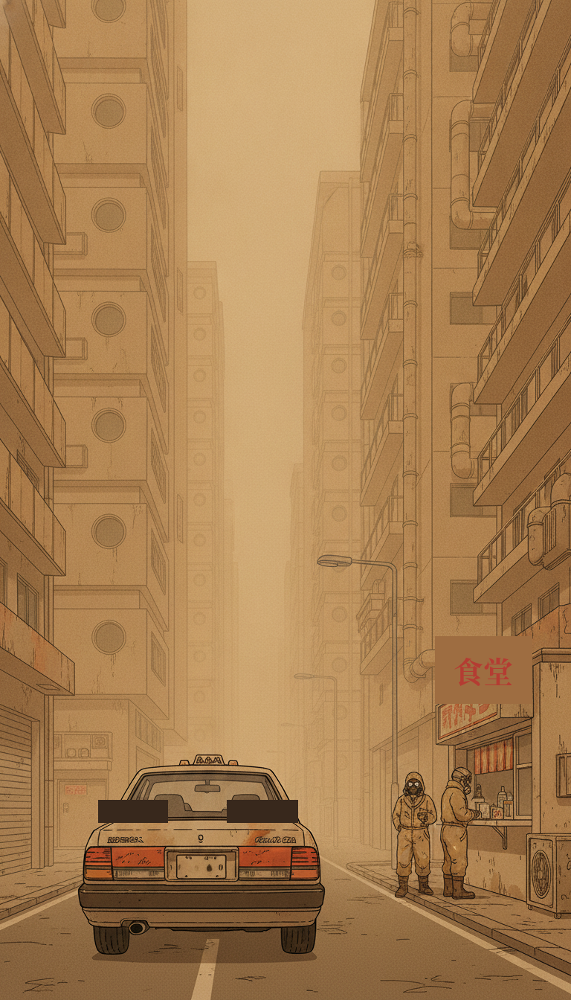
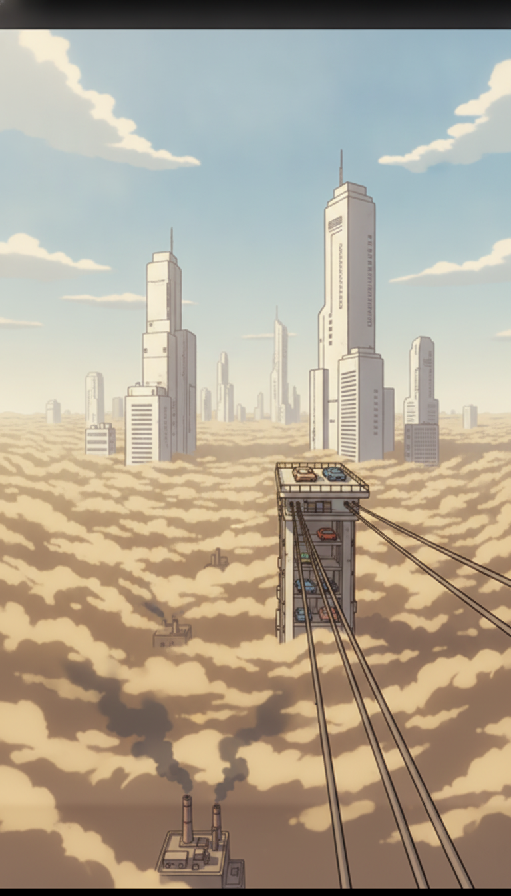
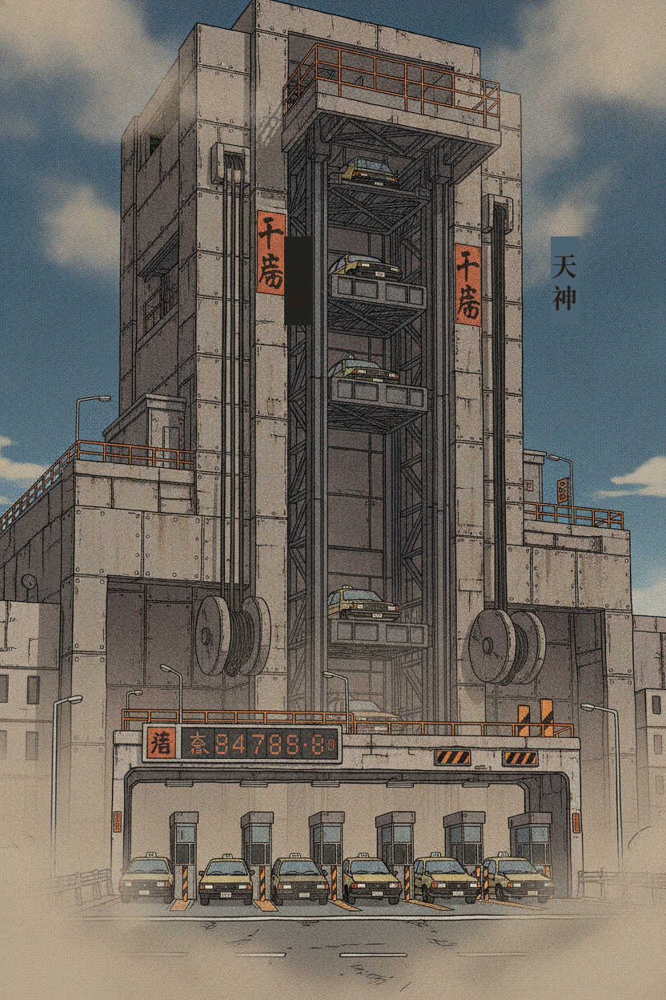
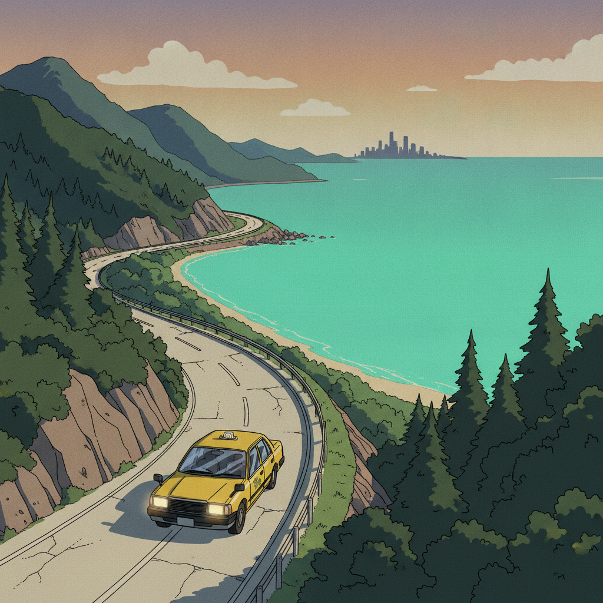
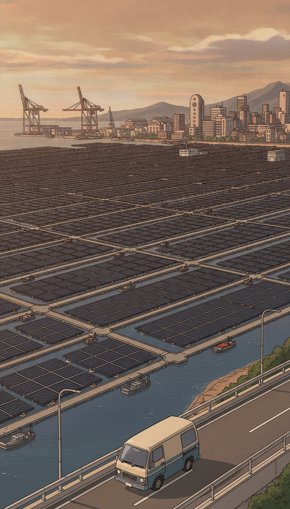
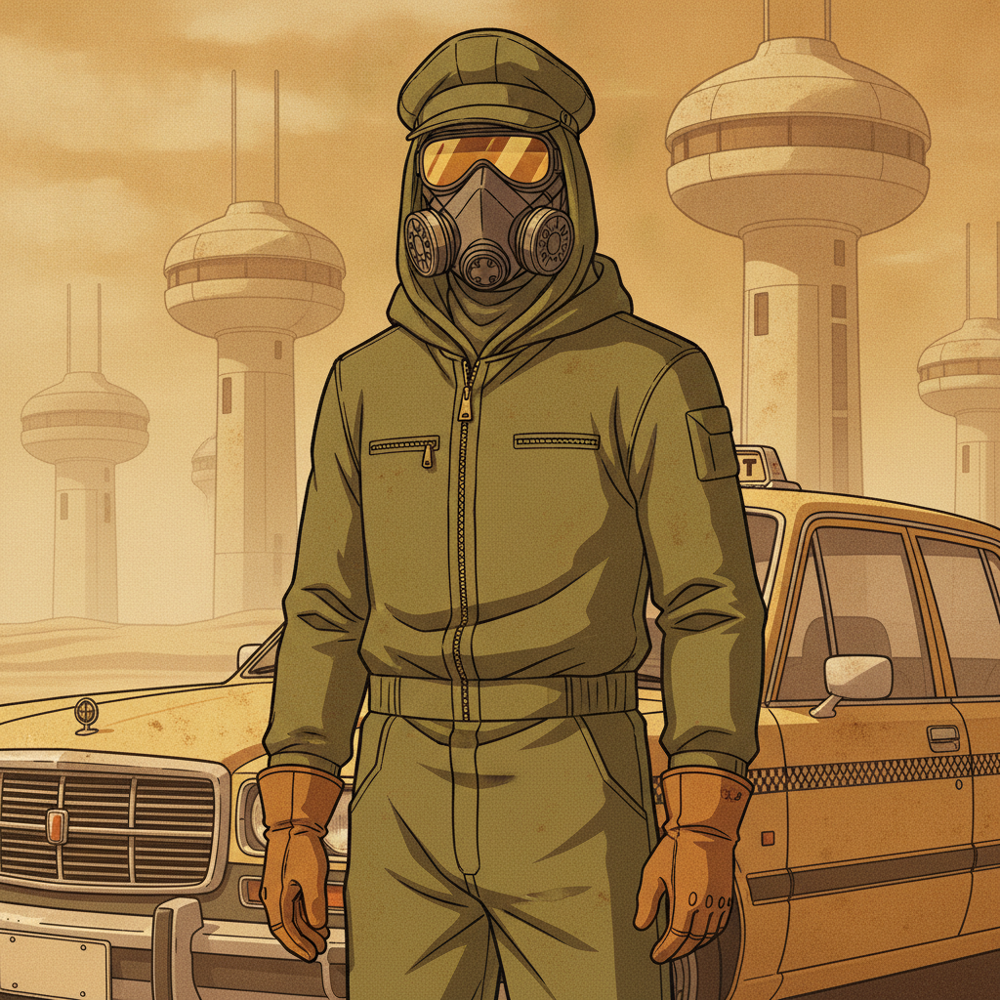

# KUROGANE BAY — World Bible (v2.1 systems draft)
### Tokyo Drift 3D: the gig-driver game

*Written 2026-10-05, revised same day with Craig's refinements. Direction chosen by Craig: delivery + cab gig game in a Mad-Max-Tokyo vertical dust city. The world/visual canon is retained. The 2026-10-06 systems revision is a draft implementing Craig's requested design direction, with tuning and sequencing recommendations still open for review. It supersedes the conflicting economy/navigation/story-budget proposals in v2 and keeps `showa-direction-options.md` as historical exploration. It does not approve new implementation or revoke existing Lower City/Forge/police/traffic work.*

**2026-10-06 direction:** recognize Cloudpunk as a direct reference; prioritize a small, readable supply-chain economy and procedural delivery work, meaningful loads/routes and garage growth. Retain authored places, people and lore. Intercity arbitrage, following trucks/fleet and full combat are later ambitions. The bounded model, tick duration, recipe counts, fee caps and phases below are recommendations, not newly confirmed user mandates. [Research, sources, playtest gates and open decisions](art-book/design-review.md) · [source reconciliation and mirror rules](README.md).

**Research behind this document:**
- 4 rounds of Gemini consultation — veteran game designer / open-world lore writer / art director & media researcher (`consult/gig-city/`) + vertical-city game design (`consult/gig-city-v2/round1-vertical-city.md`: Gravity Rush 2, Cyberpunk 2077's failures, Silent Hill/Ridge Racer fog-culling, elevator-as-gate design, cutscene transition rules)
- Web research: Crazy Taxi lineage, emergent-comedy theory, post-war yakuza history, Japanese retro-futurism, **Tekkonkinkreet (Craig's childhood favorite — §16)**
- 12 nano-banana mock images — `mocks/gig-city/`, `mocks/gig-city-retrofur/`, `mocks/gig-city-v2/`

---

## 1. The city

**KUROGANE BAY (黒鉄湾 — "Black Iron Bay").** A dust-drowned industrial megaport built on the ashes of a collapsed wartime empire — **Mad Max Tokyo with a municipal government.** Showa-era canal alleys collide with vacuum-tube skyscraper sprawls, all of it choking under a permanent ochre dust layer kicked up by foundries, strip-mined bay fill, and forty years of unregulated industry. The city never sleeps because its blast furnaces, pneumatic mail networks, and deep-water container docks run mandatory round-the-clock shifts. To the outside world it is an economic miracle built on **Sol-88** — a high-density synthetic kerosene refined from deep-sea coal seams — and its status as the hemisphere's only tariff-free deepwater harbor. To its citizens it is an iron pressure-cooker where street syndicates, shipping barons, and hungry gig drivers fight for every square meter of asphalt they can see through the murk.

**The city is vertical.** Kurogane Bay has three strata (§2): the **Lower City** drowning in dust, the **Upper City** floating above the cloud layer in clean sunlight, and the **Outskirts** — mountains and a wacky-teal sea — tethered by a single highway. Car sky-elevators are the only way up. The dust is not weather. The dust is the city's breath, its wall, and its tax.

**Why a gig driver thrives here:** the street grid was never centrally planned — sunken canal roads, elevated tollways, reclaimed-alley labyrinths — and now it's stratified too. Automated transit can't handle three vertical layers of unplanned industrial sprawl. Everything high-priority moves by **point-to-point wheelmen**: independent drivers carrying cargo, envelopes, fragile black-market goods, and desperate passengers faster than the gridlocked municipal tramways ever could, and the only ones licensed to work all three strata.

**Tone law (from Craig):** the world takes itself 100% seriously — the Yakuza-game rule. Absurdity comes from the *collision of high stakes and mundane reality*, never from punchlines, parody, or fourth-wall jokes. Comedy must EMERGE from systems (Valheim/Minecraft style). Craig does not trust AI to write jokes, and neither does this bible: there are no written jokes in it.

**History law:** NOT historically accurate. The setting is retro-futurist fiction with post-war *energy* — nobody may correct it against real history, because it never happened. It is, however, rooted in real-life references (Nakagin Capsule Tower, Metabolism, Expo '70/'85, Showa industrial design — see §12).

---

## 2. The three strata

### LOWER CITY — "The Trench"
The main drivable map and where the game lives. Permanent heavy dust at ground level — visibility rarely exceeds 100 meters, and the "sky" is never empty: it's the industrial underbelly of the Upper City (hydraulic conduit bundles, elevator counterweight tracks, truss bridges, dangling cranes, foundation plates blotting out the sun). Capsule-tower housing blocks (Nakagin-style: concrete pods with porthole windows clipped to utility shafts via rusted turnbuckles) crowd the avenues. The street is a machine trench; humans stay masked, inside, or above.

**Road topology: the trench grid.** Narrow, claustrophobic, 90-degree industrial intersections, dead-end loading docks, sewer-flanked alleys, canal service roads. High-friction, stop-and-go driving. Shortcut mastery of this fixed network IS the player's core progression — the geography NEVER shifts procedurally.

**Districts:** Daikoku Piers, Kamome Wholesale Ward, Chidori Neon Strip, Tenjin Mid-Corridor, Kotobuki Slums & Repair Row, Shinkai Basin (§3).

### UPPER CITY — "The Aerium"
A separate stratum ABOVE the dust cloud: cleaner, wealthier, arcology-scale megastructures rising through the cloud layer into pale sunlight. From above you see only an endless ochre cloud sea; from below, only murk. The visual rule is absolute: **a half-second glance at the horizon or the ambient light tells you which stratum you're in** — Lower is amber murk and sodium haze, Upper is clean white concrete, halogen white, and open sky (the Gravity Rush 2 rule).

**Road topology: the skyway ribbon.** The opposite of the Lower City — high-speed sweeping curvilinear viaducts, multi-lane ring roads suspended between arcologies, banked perimeter turns. Low-friction, top-speed cruising. The two layers must NEVER feel like the same street grid, or the player's mental map collapses (the Cyberpunk 2077 minimap-spaghetti failure).

**Districts:** Haibara Heights (clifftop estates, now literally above the cloud), Minami Aerium (corporate megastructures, Councilman Minami's toll empire HQ) (§3).

**Navigation between strata:** the paper briefing identifies the destination stratum and terminal; signs and landmarks lead the driver. ROUTE-88 may change its green/white-phosphor manifest on elevator exit, but never supplies a live minimap, moving dot, computed route trace or turn-by-turn GPS (§8).

### OUTSKIRTS — "Nagisa"
Mountains and a beach with an unnaturally vivid teal-green sea (§13), distant skyscraper silhouettes on the horizon (skybox, not geometry). Connected to the Lower City by **ONE long highway** — and district transitions happen via **cutscene, never seamless driving** (explicit scope decision: no open-world streaming). The cutscene rules: 4–6 seconds max, three Showa-anime shots (wheel close-up → wide coastal viaduct over the teal sea → dashboard radio scrub), and the player **enters the new district at full cruising speed** — a catapult, not a parking brake.

### THE SKY ELEVATORS — car lifts between worlds
The only way between Lower and Upper City: gigantic brutalist freight elevators — open platforms riding cables and counterweights up through the dust layer, cars parked on decks like cargo. 2–3 elevator pylons are anchored into bedrock and punch straight through the cloud deck; they are the city's spatial anchors (glimpse a pylon through the haze and your mental compass resets).

**Later-phase elevator proposals:** these retain the vertical-world fantasy; none is required by the local-economy proof. The following queue/inspection ideas need their own feasibility and fairness review:
- **Queues & tolls** — high faction standing buys the Express Freight Line (immediate dispatch); low standing means the Commercial Hopper (tolls + delays).
- **Inspection triage** — automated gantry scanners sweep for contraband during the queue window: toggle your scrambler, bribe the gatekeeper terminal, or sweat.
- **Decontamination scrubbers** — UV/chemical fog kills Lower City biologicals. Raw contraband (Outskirts fish, unscrubbed tools) arrives worthless unless sealed in a lead-lined smuggler trunk (heavy — changes your drift physics) or the driver chooses an industrial lift with a posted condition/risk warning and a viable safe alternative. The earlier blanket 30% failure roll is retired.
- **The 8-second ascent is the Gig Triage Screen** — the fog drops away beneath you, the Lower City shrinks into an amber dust sea, you punch through into blinding sunlight while the ROUTE-88 updates with Upper City targets and shifting market prices. You plan while you climb.

**Faction control of lift terminals** remains a later endgame ambition: whoever holds the terminals taxes the vertical economy. Ownership stays authored and stable during the local-economy proof.

---

## 3. Districts (9)

### LOWER CITY

| # | District | Identity | Business | Controller | Gig profile |
|---|----------|----------|----------|------------|-------------|
| 1 | **Daikoku Piers** | Miles of rusted gantry cranes, container stacks, open-flame shipbreaking yards; offshore, the bay is carpeted with **floating solar/industrial panel arrays** to the horizon | Heavy freight, ship salvage, bulk ore smuggling, panel-field maintenance | **Kaiun-gumi** (longshore syndicate); panel fields contested with KPC | Heavy hauls, smuggling past port inspectors, panel-array service runs, docker medical emergencies |
| 2 | **Kamome Wholesale Ward** | Chaotic wet-pavement labyrinth of seafood halls, cold storage, auction stalls — dust caked on every awning | Food distribution, synthetic ice, produce auctions, payday loans | **Tsuru-kai** (merchants' mutual aid) | Perishables on a timer (tuna, live octopus), restaurant resupply, cash-bag escorts before sunrise |
| 3 | **Chidori Neon Strip** | Multi-tiered red-light alleyways: cabarets, capsule motels, pachinko palaces — the one district where the dust thins enough for blade signs to cut through | Nightlife, hostess clubs, gambling dens, synthetic liquor | **Gokuraku-kai** (pleasure-quarter union) | VIP transfers, debtor chase-downs, hostess escorts through rival turf, discreet drunk-exec pickups |
| 4 | **Tenjin Mid-Corridor** | Brutalist concrete canyon of trading houses, banks, dispatch offices; sky-elevator Terminal 2 anchors the district's north end | Corporate bureaucracy, customs clearing, paper commodities | Contested — municipal patrols paid off by corporate security | Time-critical document runs, exec chauffeuring to secret meets, counter-surveillance routes |
| 5 | **Kotobuki Slums & Repair Row** | Sunken shantytown beneath expressway supports: chop shops, pirate radio, surplus markets; the dust is thickest here | Black-market tuning, unregistered electronics, gray-market fuel, **filter-rinse bays** | **Iron Wheel Union** (driver/mechanic collective) | Parts-fetch timers, no-questions parcels, getaway runs, dust-filter service stops |
| 6 | **Shinkai Basin** | Sol-88 refining vats, cracking plants, chemical canals lit by flare stacks — the dust source; visibility at its worst | Synthetic fuel refining, bulk plastics, toxic waste | **KPC security** (petro-chemical corp) with Kaiun-gumi ties | Volatile fuel-canister runs (impacts raise explosion risk), whistleblower extractions, midnight sludge disposal |

### UPPER CITY

| # | District | Identity | Business | Controller | Gig profile |
|---|----------|----------|----------|------------|-------------|
| 7 | **Haibara Heights** | Cliffside estates and executive villas **above the cloud layer** — terracotta roofs in clean sunlight, private gardens, the dust a distant amber sea below | Private equity, lobbying, money laundering, high-society auctions | Demilitarized zone of the **Tycoons**, private security | Luxury limo gigs, discreet personal deliveries (tapes, wine, pedigree pets), silent rides — never look in the mirror |
| 8 | **Minami Aerium** | Arcology megastructures: white concrete towers, skybridges, corporate plazas with 360° horizons; sky-elevator Terminals 1 & 3 | Toll concessions, transport monopoly HQ, clean capital, speculation | **Councilman Minami's** transport board + corporate security | Corporate courier runs, toll-jurisdiction escapes, executive extractions, decontamination-dodging smuggles |

### OUTSKIRTS

| # | District | Identity | Business | Controller | Gig profile |
|---|----------|----------|----------|------------|-------------|
| 9 | **Nagisa Coast & Mt. Kurogane** | Pine mountains, a beach with a **vivid teal sea** (§13), the single long highway in; Kurogane Bay's skyscrapers a hazy silhouette across the water | Fishing (the teal catch), mountain logging, coastal refueling, pirate radio | Unaligned — hermit fishermen, mountain crews, **Iron Wheel Union** waystation | Long-haul highway runs, fragile seafood expresses, outskirts-to-city smuggles, mountain switchback time trials |

**Road-variety requirement (from Craig):** the current single-lane map is insufficient. The Lower City's authored network MUST include: multi-lane expressway (elevated tollway ring), narrow market alleys (Kamome), neon canyon streets (Chidori), canal-side service roads (Daikoku), industrial haul roads (Shinkai), under-expressway shanty lanes (Kotobuki). The Upper City adds the skyway ribbon (curvilinear viaducts, banked ring roads). The Outskirts adds the single long highway + mountain switchbacks. Shortcut mastery of this fixed network is the core skill progression.

---

## 4. The economy — who makes money how

```
[RAW IMPORTS: ore / crude / cathode semiconductors / livestock]
        │  (Daikoku Piers — Kaiun-gumi off-manifest levies)
        ▼
[SHINKAI REFINERIES: Sol-88 synthetic fuel (KPC monopoly)]
        │
        ├──► [KOTOBUKI CHOP SHOPS: street modding + siphoned gray fuel + filter rinses]
        ├──► [KAMOME MARKET: cold-chain food → Haibara estates / Kotobuki scraps]
        ├──► [PANEL FIELDS: KPC power revenue; Iron Wheel tappers siphon for elevator bribes]
        └──► [CHIDORI CLUBS: vice cash → laundered via cab drivers → Tenjin banks]
                        │
                        ▼
        [TENJIN TYCOONS: clean capital outflow, speculation, tolls]
                        │
                        ▼
        [UPPER CITY: sealed freight, decontamination/access costs; Minami takes tolls]
```

**Money flows (worldbuilding anchors; operational job generation is specified below):**
1. **The Harbor Siphon** — unregistered cargo moves by midnight van from the piers to Kotobuki chop shops → refurbished goods reach Chidori/Tenjin. Payment comes from delivery and repair work with real input costs; a blanket 300% neighborhood markup is retired.
2. **The Synthetic Bloodline** — Sol-88 flows to licensed stations; syndicates siphon ~15% to fuel the underground delivery network and street-racing scene. Fuel price fluctuates with faction wars (canon: gas is never free, never infinite).
3. **The Morning Wholesale Squeeze** — Tsuru-kai controls all food entering Kamome; kickbacks from haulers; cash laundered through Tenjin paper firms.
4. **The Neon Wash** — Chidori's physical cash moves across town *by cab driver* to avoid electronic scrutiny → Tenjin shell banks.
5. **The Paper Chase** — tycoons pay off-the-books couriers to move bond certificates and blackmail material ahead of regulatory raids.
6. **The Vertical Freight Gate** — later sealed freight between strata earns fees for access, queue time and decontamination. The old automatic 3×/5× price gaps are retired. Larger merchant margins require genuinely separated depot/intercity markets with finite demand, travel time and costs; the elevator alone is not a money loop.
7. **The Dust Tithe** *(new)* — every Lower City vehicle pays the dust: filter replacements, air-rinse bays, radiator scrubs. Kotobuki's rinse bays are the most recession-proof business in the city.

### How the player learns the economy: the settlement chit

The ROUTE-88 prints a receipt with **gross earned, condition/late adjustment, costs already paid, costs still due, and net**. Sol-88 excise belongs to the fuel purchase; the Dust Tithe belongs to actual filter/rinse service; roadbed access tariffs belong to the gates used. Itemize their attribution to the trip without deducting them twice at delivery. Estimates before acceptance and actual costs afterward explain the difference. KPC owns the fuel, dust wears the car, Minami taxes the road: lore remains in the paperwork.

### Local production — recommended bounded model

**Scope proposal:** six business nodes inside the existing map, four goods, two recipes. Decorative businesses remain decorative; no simulation of every resident, worker, vehicle or faction balance sheet. The six-node proof uses two three-node chains:

| Chain | Producer → converter → consumer | Visible cause and effect |
|---|---|---|
| Repairs | Daikoku salvage yard: scrap → Kotobuki machine shop: repair parts → Tenjin service depot | Deliver scrap, see a queued batch start; after its production time, a parts-delivery offer appears. The depot consumes parts on its bounded service schedule. |
| Food | Kamome wholesaler: ingredients → Chidori canteen kitchen: meal crates → Daikoku shift canteen | An input shortage halts kitchen output; delivery restores one batch; the shift canteen consumes meals at scheduled intervals. |

For the first recipe sheet, propose 2 scrap → 1 repair-parts crate in 6 ticks and 2 ingredient crates → 1 meal crate in 3 ticks. Recipe units are containers, not equal physical mass; outputs/byproducts must never create tradable material from nothing. Each node has finite input/output storage, batch capacity and a receiving limit. Later electronics or filter manufacture is an optional third chain, not another launch dependency.

Raw stock enters through **explicit, capped port/wholesale import schedules**. End consumers remove goods on bounded schedules and replenish a capped purchasing budget from an external customer-demand allowance. These are declared economy sources/sinks, not invisible rescue spawns. Fuel, repairs, rents and taxes are cash sinks. NPC fulfillment is an abstract, scheduled stock transfer with a visible arrival notice; do not simulate every truck. Leave a measured fraction of demand for the player, rather than letting instant NPC arbitrage erase the job board. [Bannerlord inspiration and source limits](art-book/design-review.md).

### Tick, job and transaction contract

**Proposed clock:** a fixed 10-second simulation tick, independent of render rate. Pause freezes economy, deadlines and spoilage together; no offline progression in the slice. Save the seed, tick index, event order, inventory, reservations, quotes, jobs, cash and upgrade state. On resume, process only uncommitted ticks; no catch-up jackpot. Tick order is stable: due imports/consumption → completed production → eligible new batches → unreserved deficits/offers. Player pickup/delivery events join the same ordered ledger with unique IDs.

Procedural jobs are generated from **unreserved deficits** against available source stock and reachable legal receiving bays. A job records source, destination, quantity, mass/slots, owner, condition rule, quote expiry, loading allowance, due time, payout cap and risk band. Filter impossible routes, incompatible cargo and over-capacity loads before offering them. Offer variety is a seeded choice among feasible needs; a cooldown suppresses identical repeated manifests. No infinite timer-based job faucet divorced from inventory.

Acceptance atomically reserves source stock, destination capacity and fee budget. Pickup transfers reserved stock into customer-owned cargo. Delivery atomically transfers accepted units, records condition and pays once; replaying a signal cannot pay again. Cancellation/expiry releases reservations once. Pre-pickup withdrawal has no reward; picked-up returns go back to source with no reward or material conversion. Only one legal ownership state exists for each lot: source, reserved, aboard, delivered, returned, consumed or written off.

### Prices, fees and the small-city boundary

Local hauling earns mainly a **service fee** for distance, handling, access and optional urgency/risk. It does not require one street selling the same box for five times its neighbor's price. Prototype merchant prices later as a modest, disclosed stock band (initial hypothesis: 0.9–1.1 × common reference price), finite quotes, transport costs and a buy/sell spread. Lock accepted contract fees; timestamp unaccepted quotes. Bulk purchases/sales move the available stock and the next quote. Cap destination demand so endless dumping stops paying.

This is a deliberately open, bounded economy, not a claim of complete macroeconomic realism. Regional/intercity price differences only arrive with actual separated suppliers, distance, shipping schedules, border/toll/access costs and finite demand. Keep a legal ordinary-job floor and reserve high margins for visible constraints. If the price model demands implausible local gaps to feel fun, improve the delivery decisions before increasing the multipliers.

### Failure, recovery and exploit boundaries

- **Late/damaged freight:** disclose a bounded reduction or rejection threshold. Valid partial deliveries consume and pay only the accepted units. Spoiled/seized/destroyed stock is written off once. The remaining obligation closes or returns under the printed contract; no repeated failure fee.
- **Fair disruptions:** publish checkpoint/toll bands before acceptance. A closure after pickup must leave a viable detour plus deadline relief, or allow penalty-free return. No unavoidable ambush at a blind turn or attack during a loading/menu state. If pursuit becomes inescapable, the failure must still lead to recovery, not bankruptcy without options.
- **Bust/tow:** integrate with the existing police/arrest work through its eventual accepted interface. Proposed cap on loss, a receipt and return to a known safe bay prevent stacked fees; the exact respawn remains that task's decision. No remote teleport preserving a valuable delivery reward.
- **Zero-cash recovery:** provide a non-transferable basic loaner or repair/fuel allowance for one legal recovery contract. It cannot be sold, stored, crafted, cashed out or repeatedly claimed while an allowance is active. The basic job covers its costs and leaves positive net; no exponential debt, permanent loss of the only working vehicle or mandatory contraband.
- **No resource loops:** customer freight cannot fund upgrades; legal salvage has a unique origin and bounded award. Crafted output plus resale cannot exceed inputs plus paid work through a repeatable instant loop. Buying, returning, refunding, duplicate settlement, save/reload, upgrade removal and renting/canceling parking all need ledger checks. Prices round consistently in integer currency.
- **No induced-shortage jackpot:** destroying goods or hoarding inputs cannot raise the payout of one's existing reservation; reward bands are capped. Hold/reservation expiry and capped NPC imports keep one blocked chain from freezing every legal job. Recovery work remains available independently.

### Authored anchors, procedural consequences

Keep the district histories, faction motives, recurring dispatchers and a few short introductions/milestone scenes. Propose one reusable manifest template per job family, a small curated bank of radio lines, and business-specific supply/risk constraints. The seven money flows above are **worldbuilding and optional anchor vignettes**, not seven mandatory branching campaigns or bespoke mechanics for every generated job. Generated work recombines approved places, goods and rules; it never invents new lore or requires runtime story generation. Review the templates, contradictory combinations and state transitions, then sample seeded shifts.

**The tycoons above the factions** (Night-City-style power tier):
- **Baroness Chiyo Moriyama** (Moriyama Heavy Logistics) — owns the land the docks sit on; sets the tariffs that decide whether syndicates feast or starve. The Kaiun-gumi *think* they run the harbor.
- **Director Hidetaka Vance** (CEO, Kurogane Petro-Chemical) — government-backed Sol-88 monopoly; treats the city as an engine that consumes fuel and lives to produce export value. Claims the panel fields.
- **Councilman Goro Minami** (Metropolitan Transport Board) — deliberately suppresses public rail so his family's bus networks, tollway concessions, **and sky-elevator monopolies** can toll every wheel in the city — vertically. The reason the gig driver exists. (The Minotaur of Kurogane Bay — §16.)

---

## 5. Factions — the war map

### Kaiun-gumi (海運組 — Ocean Transport Syndicate)
- **Origin:** demobilized naval logistics crews and dockers who cleared harbor wreckage after the war; became the brute-force masters of the waterfront. (Echoes the real Yamaguchi-gumi's 1915 dock-labor origins — energy, not history.)
- **Territory:** Daikoku Piers, outer anchorages, Freight Gates 1–9, the near-shore panel arrays.
- **Rackets:** stevedore extortion, container theft, maritime smuggling (weapons, untaxed whiskey, bulk steel), heavy-equipment chop shops, panel-field "maintenance fees."
- **War:** blood feud with the **Tsuru-kai** over Kamome's cold-storage customs gates; skirmishes with **KPC** over who taxes the floating panels.
- **Leader:** **Oyabun Ryuzo "The Winch" Murata** — gravel-voiced, fifty, missing his left ear to a snapped cable. Behind the respirator, only his eyes show. Treats every unmarked container as an act of war. Respects drivers who don't flinch; sinks cars over unpaid harbor tolls.

### Gokuraku-kai (極楽会 — Paradise Society)
- **Origin:** post-war black-market dance halls and cabaret rings; built on hospitality, synthetic vice, and show business.
- **Territory:** Chidori Neon Strip, North Canal motel row.
- **Rackets:** hostess clubs, illegal card parlors, "Spark-9" stimulants, celebrity blackmail, licensing kickbacks.
- **War:** cold proxy war with the **Iron Wheel Union** over the supply lines into Chidori.
- **Leader:** **Madame Hanayo Kanzaki** — elegant, sharp-tongued; her mask is custom-lacquered black with a painted red smile. Smokes thin charcoal cigarettes through a filter-slot in her velvet office above the Starlight Lounge. Uses cab drivers as her intelligence network — pays handsomely for eavesdropped passenger gossip.

### Tsuru-kai (鶴会 — Market Crane Brotherhood)
- **Origin:** armed mutual-aid collective of fishmongers and grain peddlers who defended supply wagons during the Great Fuel Famine.
- **Territory:** Kamome Wholesale Ward, North Rail Depots.
- **Rackets:** produce price-fixing, synthetic-ice monopoly, extortionate merchant loans, freight-lane tolls.
- **War:** at war with the **Kaiun-gumi** over dockside cold-chain; starving Kaiun-affiliated mess halls of supply.
- **Leader:** **"Abacus" Kenjiro Sato** — mild accountant in a merchant apron over bespoke wool, canvas dust hood, brass abacus; carries it, not a gun. Destroys rivals through debt, supply starvation, and razor-wire ambushes on supply avenues.

### Iron Wheel Union (鉄輪連合 — Tetsurin-rengo)
- **Origin:** rogue courier drivers, midnight drag-racers, and wildcat chop-shop mechanics who refused the harbor syndicates.
- **Territory:** Kotobuki Slums, the under-expressway ring, South Canal shallows, the Nagisa waystation.
- **Rackets:** black-market vehicle mods, underground pink-slip racing, unregistered courier dispatch, siphoned fuel, **panel-field power tapping**, filter-rinse bays.
- **War:** rolling skirmishes with municipal traffic police and Gokuraku-kai extortion squads; the only faction that runs the broken industrial lifts.
- **Leader:** **Boss Tetsu (Tetsuo "Camshaft" Ogata)** — grease-covered savant with a steel-rod spine, welder's mask pushed up over a respirator; speaks in mechanic-jargon bursts. The roads are a sacred commons: drive well and earn his respect; try to regulate his garages and find your brake lines cut. **The player's natural early ally** — the union is where gig drivers belong.

**Faction design law:** no faction is "the mafia" — each has a civilian economic origin (dockers, fishmongers, cabaret owners, drivers). Wars are over *logistics chokepoints* (customs gates, cold-chain, supply roads, **elevator terminals, panel fields**), never abstract "turf." Every war must be drivable: a blockade is a route-planning problem, a rivalry is a choice of which dispatcher to favor.

---

## 6. The cast (recurring)

**CHARACTER DESIGN LAW (from Craig): every character wears dust-protection masks and clothing. No faces are ever modeled** — full-face respirators, goggles, hoods, scarves. This makes every cast member mysterious AND cheap to build: silhouette + mask + props carry the entire identity. A character is recognized by their mask, not their face.

1. **"Auntie" Shizue Miyamoto** — chief dispatcher, Asahi Radio Cab & Delivery. Olive dispatcher's coverall, vintage telephone-operator headset worn OVER a canvas dust hood, cigarette permanently in a filter-slot. Barks orders like artillery; treats drivers like wayward sons. *Primary early-game gig source; her "personal favors" spiral into syndicate messes.*
2. **Taro "Clean Towel" Inaba** — senior Gokuraku-kai club driver. Immaculate black suit, white gloves, polished chrome half-mask; speaks in honorifics while scrubbing blood off leather. *Hands off double-booked VIP routes; calls for high-speed intercepts when patrons stalk hostesses.*
3. **Inspector Kenichi Dan** — demoted traffic detective living in his unmarked cruiser. Trench coat, cracked leather respirator, one amber lens missing from his goggles. Cynical, exhausted, stubbornly just. *Flags the player down as a fare to tail suspects or beat corrupt superiors to crime scenes.*
4. **Mariko "Zero-Gauge" Katsu** — Kotobuki's star mechanic, garage in an abandoned train shed. Welder's mask, bandana, oil-stained coverall with a hundred pockets; hyperactive turbo obsessive. *Sends speed-trial gigs to test experimental mods; needs rare parts fetched from rival turf on a timer.*
5. **Kenji the Fish-King** — Kamome's dawn tuna-auction king. Rubber boots, blood-stained apron, fisherman's sou'wester over a simple cloth mask; booming, screams everything. *Fragile high-speed cargo: million-yen tuna to Haibara before rigor mortis; hard braking docks pay.*
6. **Sister Beatrice** — foreign missionary running an unlicensed slum clinic. Gray habit, surgical mask under a dust veil; deadpan, unsqueamish. *Emergency medical runs: wounded drivers from back alleys, black-market plasma deliveries — no police.*
7. **Shinji "Slippery" Uno** — Tenjin corporate bagman. Sweaty, neurotically punctual, three gold watches over his cuffs; a cheap paper dust mask he replaces hourly. *Time-critical briefcase handoffs while rival corporate muscle tries to ram you into contract default.*
8. **The Record-Shop Phantom** — reclusive audiophile courier of rare vinyl and master tapes. Long coat, wide-brim hat, dark goggles, voice-muffling scarf; never seen unmasked, possibly twice. *Ultra-gentle deliveries: G-force thresholds; one pothole destroys the payload.*
9. **Lieutenant Kuga** — Kaiun-gumi dockside enforcer. Black coverall, iron pipe, featureless industrial respirator; cold-eyed — his pipe does the talking. *Muscle gigs: move silent faction members; ram rival scouts blocking dock chokepoints.*
10. **Little Sparrow** — 13-year-old Chidori shoeshine and message boy. Oversized scavenged mask, patched jacket; cocky, fast-talking, scared underneath. *Evasion gigs: dives into your back seat mid-pursuit; thread service alleys to shake syndicate foot soldiers.*
11. **Mrs. Yamashita** — 80-year-old widow; calls a cab every Tuesday 11:15 AM sharp. Neat kimono, lace-trimmed dust veil, hands out barley-tea candy through the window. Sweet, polite. *Slow, gentle rides through gang-war zones to her husband's grave — the moral heart of the world.*
12. **The Meter Maid** — unnamed municipal parking enforcer on a three-wheeled scooter; white helmet, mirrored goggles, respirator, ticket book on a coiled cord. Never speaks, only writes. *A systemic comedy engine: the city's most feared antagonist is a traffic warden.*
13. **"Highline" Adaeze Okafor** *(new — Upper City)* — elevator Terminal 1's dispatcher-queen; white uniform, gold-braided cap, porcelain half-mask. Controls who rides up and who waits. Politeness is a weapon. *Gatekeeper gigs: earn her favor for Express Freight Line access, or run the broken lifts.*

---

## 7. Gig taxonomy

### Work families retained from the earlier brief
1. **Delivery A→B** — the bread and butter, with ordinary forgiving windows and optional premium timed work.
2. **Race events** — pink-slip sprints, checkpoint rallies, outrun-the-interceptors.
3. **Personal/chauffeur delivery** — people, not packages. *Owning a fancy car (Appeal ≥ 70) adds ~20% more personal-gig offers* — the clients check the car before they check the driver.

### Procedural templates — bounded combinations, not infinite content
**Scope recommendation:** start with robust contract freight, two-stop batching and existing passenger behavior, driven by the finite needs in §4. Customer cargo, owned merchant stock and passenger seats have different ownership rules; contraband is a declared modifier. The remaining templates are a staged catalog, not a requirement to implement fifteen mechanics at once. All historic multipliers/stat gates below are unvalidated tuning proposals.

Each template varies along three axes: **payload rules** (how it behaves in the car), **route pressures** (what the world throws at you), **payout conditions** (how you're paid).

1. **Point-to-Point Express** — time buffer × traffic density × dust visibility × police radar zones. Tests: speed, map knowledge, shortcuts.
2. **Fragile Egg-Run** — fragility threshold × G-force tolerance × bump sensitivity. Tests: throttle/brake modulation, curb avoidance. *(Wedding cakes, stemware, nitro cells.)*
3. **Multi-Drop Milk Run** — 3–6 drops, sequence locked or free, cascading timers. Tests: cargo capacity, micro-routing, stop-and-go acceleration.
4. **V.I.P. Chauffeur** — passenger neuroses ("hates red cars," "nauseous over 40 mph"), paparazzi tails. Tests: Appeal, comfort meter under pressure.
5. **Hot Contraband** — heat level 1–4, decay/smell meter, patrol density, roadblocks. Tests: speed + health, line-of-sight breaking, alleycraft.
6. **Volatile Mass** — sloshing center-of-mass (liquid/livestock), detonation/escape timer. Tests: counter-steering, momentum preservation.
7. **Undercover Shadow** — tailing: paranoia meter (too close), drop-back limit (too far), randomized target turns. Tests: throttle control, blending into traffic.
8. **Heavy Haul / Flatbed Repo** — towed weight, trailer swing, low clearances, hitch-ramming pursuers. Tests: torque, wide-turn planning, defensive driving.
9. **Cryo-Timer** — payload temperature vs. cooling-station detours; melt rate tied to engine RPM. Tests: route flexibility under a macro countdown.
10. **Road-Rage Escort** — VIP car health bar, pursuer count, weaponized traffic. Tests: vehicle health + mass, blocking, peeling aggro.

### Stratum gigs (only possible in a vertical dust city)
11. **Elevator Queue-Jump** — a client pays triple to make the next lift cycle: thread the terminal queue, bribe or bluff the gate, board before the doors seal. Tests: nerve, faction standing, timing.
12. **Decon Dodge** — move raw contraband (Outskirts fish, unscrubbed tools) through the elevator scrubbers: seal it in the lead trunk (heavy — drift physics change) or risk the broken industrial lift. Tests: loadout planning, risk appetite.
13. **Filter Clock** — a timed run where your particulate filter is already 80% saturated: finish before the engine chokes, or detour to a rinse bay and lose the bonus. Tests: route efficiency under a degrading vehicle.
14. **Grease-Fall Drift** — Upper City runoff slicks a Lower City corridor: chain drifts through zero-traction zones for multiplier gigs. Tests: counter-steering, commitment.
15. **Nagisa Long-Haul** — the single-highway outskirts run: one road, no shortcuts, fuel and filter math the whole way. Tests: endurance, preparation, highway speed.

### Authored anchors — a small reviewed set, not a 25-mission requirement
Keep a few dispatcher introductions, relationship moments and progression milestones. The eight premises below are preserved as optional worldbuilding, not mandatory branching missions or vehicle-unlock exams. Prove repeatable work with dialogue disabled; then choose a small anchor budget for the slice. Progression does not require writing another sixteen or seventeen missions. Pager/radio delivery and physical documents keep the story inside the cab. No runtime generated dialogue is required.

Premises in Craig's style (interesting stories, not jokes):
1. **"The Scent of Osmanthus"** — a sweaty exec is late for his anniversary dinner *with his mistress*, but left his wife's heart medication in the family sedan across town. Mid-route: his wife collapses, rushed to the hospital *opposite the restaurant*. Floor it to the hospital with the meds, or drop him at the restaurant to save his double life — while he has a moral breakdown in your back seat.
2. **"Paternal Radar"** — Oyabun Murata, in a beige trench coat and bucket hat over his respirator, hires your cab to tail his daughter's first date without blowing his cover ("I'm a shipping manager"). Mid-tail, a Tsuru-kai hit squad recognizes his frame in your back seat: evade the ambush while driving smoothly enough the daughter never notices her father gunning down rivals 50 meters behind her.
3. **"The Prime Catch"** — Kenji the Fish-King's 220 kg bluefin must reach the Grand Bay Hotel before the 5:30 AM press breakfast; Kaiun-gumi has blockaded the market gates. The melting ice kills your rear traction. Bypass via drainage canals and an unfinished ramp bridge.
4. **"Discreet Extraction"** — Chidori's No.1 hostess flees a drunk, weeping police superintendent barricaded in her dressing room — carrying his service revolver *and* his payoff notebook. Gokuraku enforcers demand the book mid-route. Sell out the passenger for syndicate favor, or break the blockade to honor the fare?
5. **"The Midnight Kidney"** — Sister Beatrice's organ cooler has a dying battery: it only charges above 3,500 RPM. Cross the city at high revs through truck traffic and speed checkpoints without stalling or crashing — dropping below speed kills the patient.
6. **"The Whistleblower's Route"** — a KPC engineer carries proof of toxic dumping into Kamome's seafood beds. KPC security is hunting him. Mid-route, Moriyama Heavy Logistics offers a life-changing bearer payment to redirect him to a quiet dock warehouse. Justice or the payout?
7. **"The Maestro's Fragile Masterpiece"** — the Record-Shop Phantom's one-of-a-kind acetate shatters above 0.4 G. Mid-route, an illegal drag race swallows the expressway. Velvet-smooth driving through nitrous chaos, on a studio-rental clock.
8. **"The Cloudbreak Fare"** *(new)* — "Highline" Adaeze's own mother needs to reach a Haibara clinic, but Adaeze can't be seen favoring family on the manifest. Get her through Terminal 1 inspection *as contraband*: sealed trunk, scrubber timing, no questions. The gatekeeper's favor is the payout.
The former “+16 more” commitment is retired; the original §17 also said seventeen, so neither count is a production requirement.

---

## 8. Pre-gig planning — manifest, signs and paper map

**Current direction:** no GPS. ROUTE-88 is a chunky in-dash CRT punch-card manifest and settlement terminal, not a disguised navigation app. The *CHUNK-CHUNK* and green/white phosphor remain. A briefing marks pickup/destination on a paper-style map; street signs, district silhouettes and landmark memory teach the fixed city. No moving player dot, computed route line, magnetic waypoint snapping or turn-by-turn directions. The older GPS exception is retired.

The offer lists quantity, ownership, mass/slots or passenger seats, condition rules, loading allowance, optional deadline, quoted fee, known toll/inspection bands and expiry. Dated radio/split-flap notices reveal conditions; the driver chooses a route. In the proposed single-player slice, planning pauses economy, spoilage and deadlines together. Ordinary work has no universal 60-second planning limit or automatic 1%/second payout decay. A clearly optional Quick-Dispatch premium may be tested separately.

**Working loop:** read demand → reserve a feasible manifest and receiving space → fit a load/module → drive by signs/map → deliver a visible stock consequence → settle once → return with money/legally awarded materials → repair, invest or take another job. [Lower City §9A](art-book/lower-city/chapter.md) gives job ownership and the worked heavy/light comparison.

**Choices:** a gas/rinse stop costs cash and time but restores range; consolidation saves repeated stops and empty returns but adds mass, braking distance and access limits; a legal passenger may fill an unused seat if cargo safety permits. No automatic doubled hitchhiker payout or garage action that erases wanted state. Posted police rules and the accepted arrest implementation control recovery. Upper City plans later use separate paper briefings, preserving its distinct stratum above the clouds.

---

## 9. Vehicles & progression economy

### Roster (6 archetypes — original designs, no real-car copies)
| Vehicle | Class | Silhouette | Unlocks |
|---------|-------|-----------|---------|
| **Hinode Carrier** | Starter beater cab | Boxy '70s notchback, rooftop VACANT flag, fender bullet mirrors | Cab fares, point-to-point |
| **Tatsumi Hauler** | Cargo van | Cab-over flat-nose, brass pneumatic courier cylinders, split tailgate | Multi-drop, heavy haul |
| **Ohtori Sovereign** | Luxury sedan | Stretched brutalist barge, full-width vacuum-tube taillights, lace curtains | VIP/chauffeur, corporate escort |
| **Raiden Fastback** | Tuner/muscle | Wedge profile, exposed carburetors through hood cutout, turbine wheels | Hot contraband, underground outrun |
| **Goliath 800** | Heavy flatbed rig | Twin-steer tractor, knuckle-boom crane, winch bumper | Oversized freight, syndicate heavy work |
| **Mirage Zero** | Exotic wedge | Doorstop show-car wedge, pop-up headlight brow, louvered engine deck | Top-tier syndicate gigs, prestige fares |

### Upgrade economy — requested goals, proposed staging

Craig's direction retains speed, cargo size, health and appeal, plus garage/resources growth. The six chassis are the long-term art vocabulary. Start with the existing vehicle and two useful load/module configurations; preserve active Forge work. Five visual tiers per stat are available art studies, not a commitment to 120 mechanical upgrades or mandatory scripted exams. Numeric class gates and lease shares remain tuning hypotheses.

Use finite, visible contract fees instead of stacking surge and flawless-tip multipliers without a budget. A lease can let players try heavier work, but its fee and return terms must be posted and ledger-safe. Racks, armor and cooling add mass/space/operating costs; a faster small vehicle keeps its alley/handling niche. Filters slow recurring wear rather than permanently ending the Dust Tithe. [Fleet & Gear](art-book/fleet-gear/chapter.md) is the visual/upgrade detail source.

### B6. HOME GARAGE — money, materials and a reason to return

**Craig's direction:** resources brought home fund improvements, better handling/speed/capacity, later vehicles and parking. **Recommended rules:** one protected home bay, limited owned-stock storage, a repair bench and a manifest shelf. Storage transfers are atomic; only player-owned goods and explicitly awarded legal salvage enter upgrade recipes. Customer freight stays sealed even when parked overnight.

Start with two recognizable material inputs — scrap and repair parts — plus cash. Every recipe shows exact inputs and benefit; shops offer a cash substitute at posted prices so a rare drop never gates basic progress. A proposed rack upgrade might cost 2 scrap + 1 parts crate + labor cash; selling those materials instead is an immediate liquidity choice. Avoid random component tiers and hidden recipes. Reconcile crafting yields and buyback values against the economy ledger before tuning rewards.

| Step | What changes at home | Tradeoff / scope gate |
|---|---|---|
| Starter bench and storage | Repair, fuel/filters, secured small cargo, one useful rack or handling upgrade | Ordinary work remains profitable with the starter. Cash spent upgrading cannot also cover the next fuel bill; display a working-reserve estimate. |
| Specialist module and second vehicle | Choose cargo rack, protective lining, cold box, or responsive light chassis | Modules consume mass/space and have operating costs. Faster handling stays useful in alleys; a larger van consolidates bulk but loses access/turning/braking flexibility. Cooling trades capacity and fuel for shelf life. |
| Rented parking bays | Keep a second configuration ready; later store more owned stock | Rent is quoted per shift, not offline real time. Missed rent suspends extra-bay use under a disclosed grace rule; stored goods and the starter are not silently deleted. No hidden infinite storage. |
| Abstract hired dispatch (later) | Assign one bounded route, driver, vehicle and load with a ledger | Pay wages, upkeep, fuel and parking from real proceeds. Never earn while paused; no goods teleporting between two simultaneous jobs. This is not yet a physical convoy. |
| Following trucks/fleet (last) | A visible convoy with grouping, separation and stuck recovery | Requires dedicated navigation, traffic, stop/parking and save tests. Do not make follower AI a dependency for the first garage upgrade. |

Dust filters slow wear rather than ending service forever; propose diminishing returns and a minimum service cost, subject to balance review. Armor reduces specific impact loss but adds mass; racks do not increase engine output. Handling upgrades improve a declared response/braking band, not immunity to loaded inertia. Preserve the small-car niche. T1–T5 silhouette studies remain available for later art work; fewer mechanical levels can ship first.

The garage should show the operation growing through existing props: one bench, labeled parts shelves, a painted bay number and later a rental placard. The player returns to see the resources they chose to keep. New garage art is a later request; this documentation update commissions none.

### Later money sinks

Rented bays and eventually forward garages offer convenience and storage. They do not create free transferable fuel or instantaneous repair profit: fuel/parts are purchased or drawn from owned stock, labor is priced, and rent never silently deletes goods or the starter. Infrastructure bribes, Express Freight passes and multiple-stratum property ownership remain later ideas with explicit costs and route/fairness review. They are not needed for the first useful upgrade.

---

## 10. Emergent comedy — systems, not jokes (design law)

Craig's rule is absolute: **no AI-written jokes, ever.** Authored worldbuilding remains. The following four ideas are preserved as **later experiments**, not promised slice systems; cargo slots/mass/condition come first. Physical spills, brawls, ejections and combat require separate safety-of-play, cost and feasibility review, and must respect the Kuro-Kiri suited-worker law. No current pedestrian or police task is canceled by this staging:

1. **Unsecured cargo physics** — cargo has real rigid-body mass. Brake hard without securing it and the safe goes through the windshield; the chicken crate bursts open and feathers physically block the cockpit camera until you roll down the windows. (*FlatOut/Wobbly Life* lineage.)
2. **Aggro-redirect cascades** — NPCs run an aggro state machine. Dodge a ramming cop and he hits a civilian muscle car instead — whose driver gets out and drags the cop from the cruiser to brawl while you drive away clean. (*Far Cry/GTA* lineage.)
3. **Passenger state machines** — VIPs have an Ejection Meter: cap it with G-forces and they bail out of the moving car into a dumpster, or panic-yank your handbrake at top speed. Masked VIPs ejecting *mask-first* into dumpsters is the game's signature sight gag — zero writing required. (*RollerCoaster Tycoon* nausea systems + Crazy Taxi.)
4. **Hazardous spills** — punctured cargo drops physical decals with real friction values: cooking oil (friction 0.05 — AI cars spin like bowling pins), wet cement (friction 3.0 — instant 10-car pileups), propane tanks (detonate on high-velocity impact or upgraded-exhaust backfire). (*Goat Simulator/Streets of Rogue* lineage.)

Plus the **Meter Maid**: a silent parking enforcer on a three-wheeled scooter — white helmet, mirrored goggles, respirator — who tickets wherever you idle illegally. The city's most feared antagonist, and nobody wrote a word for her.

---

## 11. Retention on one map

**Proposed proof:** the fixed city presents different useful manifests as stock, production and finite consumption change. Use seeded demand, scheduled supplier arrivals and a small number of warned route disruptions. The player can explain cause and effect; randomness must not invalidate an accepted job without relief or a return option. Repetition is measured, not declared solved.

Daily ranked challenges, dynamic faction wars/terminal control, severe dust events and flood variants remain later experiments. Do not require multiplayer economy synchronization, new geometry or a full weather system to demonstrate a second interesting shift. Use the [research review's playtest gates](art-book/design-review.md): five first-time players, two shifts, at least three seeds, comprehension/route/load-choice/recovery checks, and a separate deterministic ledger soak. These are targets, not completed tests.

---

## 12. Art direction (summary)

**The look is the moat.** 80s-anime cel: ink outlines, flat poster-color fields, 2-step cel shading, hand-painted skies. What this is NOT: Blade Runner / Cyberpunk 2077 — no neon soup, no rain-slicked magenta alleys, no microchips. Kurogane Bay is **dust-forward**: ochre murk below, clean pale sunlight above; technology is stamped steel, vacuum tubes, bakelite, rubber hoses, riveted concrete.

**Signature architecture (canon):**
- **Capsule towers** — Nakagin Capsule Tower lineage: concrete pods with round porthole windows clipped to utility shafts via rusted turnbuckles; exposed ducting and hydraulic bundles crawling up façades. The Lower City's residential vernacular.
- **Megastructures** — arcology-scale white concrete towers and skybridges in the Upper City, rising through the cloud layer. From below: foundation plates blotting out the sky. From above: 360° horizons.
- **Floating panel fields** — the bay carpeted with photovoltaic/industrial pontoon arrays in geometric grids, service catwalks, maintenance boats. Daikoku's offshore signature.
- **Sky-elevator terminals** — brutalist concrete + riveted steel, open freight decks on cables, counterweight drums, Solari split-flap boards, faction banners. The city's cathedrals.
- **The wacky sea** — Nagisa's vivid teal water (§13).

**Dust palette (canon):** `#4A4D4A` soot concrete · `#D3CEB8` industrial putty · `#A68058` tar beige · `#C8A24B` dust ochre · `#E65C00` hazard orange · `#33FF66` vector phosphor green. Shadows are warm umber/diesel soot — **never** cool blue/purple. Upper City accents: clean off-white `#EDEAE0`, halogen white, deep imperial purple `#3D2B50` (the only cool tones allowed, and only above the cloud).

**Per-district signatures:** rust-orange Daikoku piers + black panel sea; wet tile-white Kamome under dust film; cherry-neon Chidori nights (the one district where signs cut through); brutalist bronze Tenjin; tin-blue Kotobuki under the expressway; sulfur-yellow Shinkai Basin; terracotta Haibara Heights in clean sun; white-gold Minami Aerium; pine-green + teal Nagisa Coast.

**Frame-by-frame study targets for artists:** *Patlabor: The Movie* (Ogura's industrial gouache washes), *Akira* (2-band hard cel shadow separation on vehicles), *Venus Wars* (mechanical weight — tire squash, chassis dive; flat 2D anime smoke puffs, not particle clouds), ***Tekkonkinkreet* (2006, Michael Arias / Studio 4°C) — the city as a living character; street-level squalor vs. rooftop perches; lived-in density where every alley is crammed with signage, wires, and stalls (§16).**

**Media steal-list** (one thing each): *Tekkonkinkreet* (the city has a will; redevelopment as the villain; "no one owns a town") · *Battles Without Honor and Humanity* (feral post-war faction desperation) · *Patlabor* (reclaimed-industrial waterfronts) · *Megazone 23* (cassette-futurist dashboard tactility) · *You're Under Arrest* (mechanical vehicle draftsmanship) · *Yakuza 0* (deadpan-serious treatment of absurd logistics) · *Shenmue* (working-class port rhythm) · *Night on Earth* (cab interior as confessional booth) · *Crazy Taxi* (kinetic pickup/drop-off topology) · *Mad Max* (dust survivalism — Craig's energy reference; ours stays municipal, not post-apocalyptic).

### Mock art
**v1 — gig-city (from v40 captures):** `mocks/gig-city/gc1..gc6` — retro cab, harbor delivery, neon strip, refinery run, ROUTE-88 cockpit, dawn market.
**v1 — retrofur identity:** `mocks/gig-city-retrofur/rf1..rf5` — smog avenue, cockpit, KMTED cruiser, machine-trench street, harbor tram.
**v2 — vertical dust city (this revision):**

*The Trench: capsule towers loom through ochre murk; masked figures at a drive-up ramen window.*


*The cloudbreak: megastructures rise from the dust sea; a car elevator ascends on cables.*


*Terminal 2: brutalist lift tower, cars on ascending decks, taxis queuing at toll booths.*


*Nagisa: the single highway, pine mountains, the teal sea, skyscraper silhouettes across the water.*


*Daikoku offshore: the panel fields to the horizon, catwalks, maintenance boats.*


*The character law in one image: full-face respirator, no face modeled, mysterious and cheap.*

---

## 13. The wacky sea (Nagisa Coast)

The sea at Nagisa is a vivid, unnatural **teal-green** — not tropical, not algae: the wrong color, like a misprinted postcard. It stains the shoreline, the fishing boats, the sky at sunset.

**The optional backstory** *(Craig: Evangelion-like, keep sketchy):* the year the deep-sea coal seams were first cracked for Sol-88, the water changed color overnight. KPC's official line is copper runoff from the drilling rigs. Old fishermen say something woke up down there and the sea is *looking back*. The Iron Wheel Union waystation keeps a logbook of the nights the water glows. Nobody swims. Nobody has to explain it further — the mystery is the content.

**Design function:** the sea is the game's exhale — the one place the dust can't reach. Long-haul gigs end here; the color shift tells the player they've left the city without a single UI element.

---

## 14. Performance hypotheses and current-work boundary

The older cost claims below are design hypotheses, not benchmark results. Preserve current Lower City/Forge/traffic/police workers and their accepted interfaces; no old scope label here authorizes deleting their work.

| Lore decision | Engineering implication |
|---|---|
| **Permanent Lower City dust** | Exponential-squared distance fog + 50–80 m far-plane cap: the far plane is a *wall*, not a gradient. Geometry beyond it drops to silhouette. Aggressive, guilt-free culling on mobile-class GPUs. |
| **Kuro-Kiri suited-worker law** | Unsuited outdoor travel is forbidden; suited workers at posts remain legal. Static silhouettes can provide inexpensive background life. This is not a ban on the active pedestrian/Forge work or permission to delete its locomotion/hit reactions. |
| **Cutscene district transitions** | No open-world streaming system between Lower/Upper/Outskirts. Each stratum is a separate authored scene; the 4–6 s cutscene IS the loading screen, disguised as cinema. |
| **Distant skyscrapers as skybox** | The horizon skyline is painted silhouettes, not geometry. Zero draw calls beyond the fog wall. |
| **Masked characters, no faces** | No facial rigs, no lip-sync, no expression animation. Characters are silhouette + mask + props. Cutscene and NPC costs collapse. |
| **Fixed lighting per stratum** | No dynamic day/night cycle: Lower = perpetual amber murk, Upper = clean pale sun, Nagisa = teal afternoon. Baked lighting, zero GI passes at runtime. |
| **No traffic lights** | No intersection state machines, no idle downtime breaking driving flow. |
| **Bounded civilian traffic** | Earlier 12–16-car spline/raycast proposals are historical. Reuse the active road-graph traffic/spawn work and measure its budget; do not replace it with the old no-steering prescription. |
| **KMTED enforcement** | Reuse current police/arrest work under its owners. Keep new economy pressure bounded; full combat and extra pursuit systems need a later gate. No cost or fun guarantee is inferred. |

---

## 15. Canon guardrails (world rules)

1. **Showa-futurist tech ceiling** — vacuum tubes, CRTs, pneumatic tubes, carburetors, cassettes. NEVER: smartphones, internet, drones, self-driving cars. **ROUTE-88 is an analog manifest terminal, not a GPS exception** (§8).
2. **Yakuza-game tone discipline** — deadly serious world; absurdity from high-stakes × mundane collisions. No fourth-wall breaks, no parody, no supernatural (the Minotaur stays a metaphor — §16).
3. **No written jokes, ever** — comedy is systemic. (Craig's law.)
4. **The cab is sovereign ground** — couriers make the city work; syndicates don't murder neutral drivers, or the food/fuel/vice stops moving. Professional + neutral = begrudging safe passage.
5. **Geography is fixed** — the map never shifts; shortcut mastery IS progression. Strata are separate authored scenes; transitions are cutscenes, never seamless.
6. **Cash and Sol-88 rule everything** — paper yen, fluctuating fuel prices, damage persists until paid for at Kotobuki garages. **Dust is a tax:** filters, rinses, and sealed bearings are recurring costs.
7. **The wheelman stays behind the wheel** — no on-foot shooter; the vehicle is body, weapon, shield, livelihood. Interactions happen through windows, bumper, horn, trunk, radio.
8. **Every face is masked** — no unmasked human faces anywhere in the game. Kuro-Kiri prohibits unsuited outdoor travel; suited workers at their posts are legal. It does not ban all outdoor humans. (Craig's character law.)
9. **The dust is the wall** — Lower City visibility never meaningfully clears; the Upper City never sees the ground. The strata stay visually and mechanically distinct.

---

## 16. Tekkonkinkreet — what we steal (Craig's childhood favorite)

*Tekkonkinkreet* (manga: Taiyo Matsumoto 1993–94; film: Michael Arias / Studio 4°C, 2006). Treasure Town (Takaramachi): a once-prosperous metropolis reduced to a violent slum of warring gangs, targeted by the corporate developer Snake for demolition into the "Kiddy Kastle" amusement park. Two orphans, Black and White — described as *"like avatars of the city itself, its will and its voice"* — fight for the soul of their city. Black's violent alter ego, the **Minotaur**, is the city's dark side made flesh.

**WHAT WE STEAL:**
1. **The city as a character with a will.** Treasure Town isn't a backdrop; it has a soul, and its inhabitants are its voice. → Kurogane Bay's dust is the city's breath. The faction war phases, the dust storms, the grease-falls are the city *acting*. The driver isn't just working the city — the city works through the driver.
2. **Street-level squalor vs. elevated perches.** Black and White survey their whole world from rooftops and lampposts; the film's signature contrast is murk below, clarity above. → Our Lower/Upper split IS this contrast, mechanized: the cloudbreak reveal (mock v2b) is the game's rooftop moment, earned by riding the elevator instead of climbing.
3. **Lived-in density.** Every Treasure Town alley is crammed with signage, wires, stalls, laundry — density as storytelling. → Lower City set-dressing law: alleys are dressed to the choke point with cheap decals, hanging wires, and stall props. Density is faked, never simulated.
4. **Redevelopment as the villain.** Snake's Kiddy Kastle — the force that wants to demolish the organic city and pave it into something profitable. → **Councilman Minami is our Minotaur**: his toll empire, elevator monopoly, and suppressed public rail are the "redevelopment" devouring the organic street city. The tycoons are never fought directly — they're fought by *driving around them*.
5. **"No one truly owns a town."** The film's thesis: cities belong to the people who live in them, collectively. → Our cab-is-sovereign-ground rule (guardrail 4): the syndicates can't kill neutral drivers because the city — its food, fuel, and vice — moves through them.

**WHAT WE DELIBERATELY DON'T STEAL:**
1. **The supernatural.** No flying kids, no literal demon Minotaur, no White-style fantasy sequences. Our Minotaur (Minami) is a municipal transport chairman, which is scarier. The world stays deadpan-serious.
2. **Child protagonists.** Our wheelman is an adult professional; the story is economic survival, not coming-of-age.
3. **One villain to defeat.** Snake can be killed; our conflicts are systemic faction wars over logistics chokepoints. There is no final boss — there's the next shift.
4. **Nostalgic warmth.** Treasure Town loves its strays; Kurogane Bay charges them for filter rinses. Ours is harsher — Mad Max with a municipal government, per Craig.

---

## 17. Staged roadmap — proposal, not a dispatch plan

This replaces the old sequence requiring three strata, six vehicles, fifteen gig types, GPS planning and 25 scripted missions before the full loop could work. It does not reopen, reassign or reprioritize existing tasks. Read the current boards and workers before implementation; this document update authorizes no game work or watchdog dispatch.

This is a scope recommendation, not authorization to implement or cancel another worker's work. `td-185` already supplies the city/sign/map/gig foundation; traffic and cops have separate current tasks. Preserve implemented passenger/cargo behavior and police integration. The phases below describe additional economy work and its gates, not a replacement city or a reset of shipped progress.

| Phase | Bounded addition | Gate before expanding |
|---|---|---|
| 0 — preserve the foundation | Inventory current gig, save, damage, traffic and arrest behavior on the accepted game head. Exercise the existing map and signs. | Document actual interfaces and remaining defects with owners; don't import design promises as implemented facts. |
| 1 — local economy proof | In the existing city use 6 businesses, 4 goods, 2 recipes, one starter vehicle plus two load/module configurations, contract freight and existing passenger jobs. Fixed ticks, short manifests, receipts, garage storage/one upgrade, two-stop batching. No whole-population or off-map simulation. | Stock/settlement invariants and ordinary-job recovery pass; players can explain a downstream consequence and choose between heavy and light runs. |
| 2 — varied shifts | Optional third chain, owned trading stock, a second vehicle, comfort/perishable/contraband modifiers and one legible pressure layer at a time. Reuse existing police work subject to its acceptance; rivals first compete for unreserved work, bandits first use warned road events. | No repeatable money/resource loop; both vehicle niches survive; risk is understood before commitment. |
| 3 — distant depot trade | A constrained Nagisa/terminal market with a shipping schedule, real travel cost and finite imports; only then a separate intercity market, after map and handling gates. Rented parking and bounded abstract driver dispatch. | Longer routes earn margins through separation, time and access; wages/upkeep/parking remain legible and player driving remains worthwhile. |
| 4 — optional expansion | Physical following trucks, convoy recovery/formation AI, additional cities, faction territory simulation, full vehicle combat. | Separate feasibility and fun reviews for pathfinding, blocked junctions, save consistency, performance and combat. None is needed to prove Phase 1. |

A solo developer using AI still owns balance, persistence, asset rights, route QA and readable feedback. Deterministic tables and authored constraints reduce debugging/review surface; unlimited procedural text, many-agent economies and combat multiply it. No runtime generative dialogue or paid generation is required by this design.

**Next design decision:** review pressure, trading timing, material rewards, the clock/recovery policy and fleet scope in the [open decisions](art-book/design-review.md). Exact tick/recipe/price values remain test hypotheses. Keep this systems revision in draft; there is no new implementation dispatch, merge or deployment authority.
