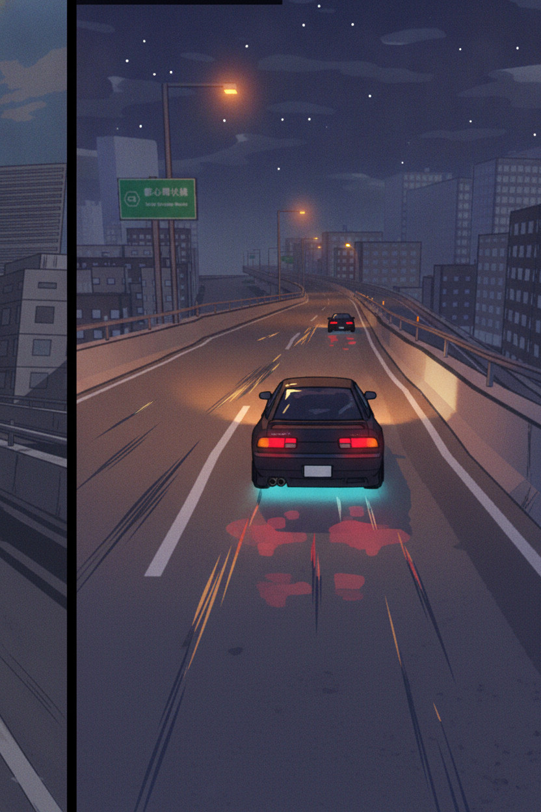
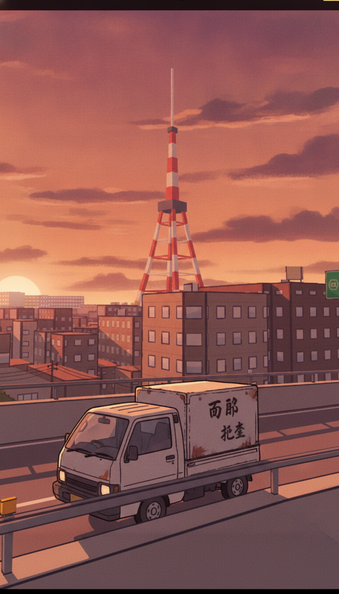
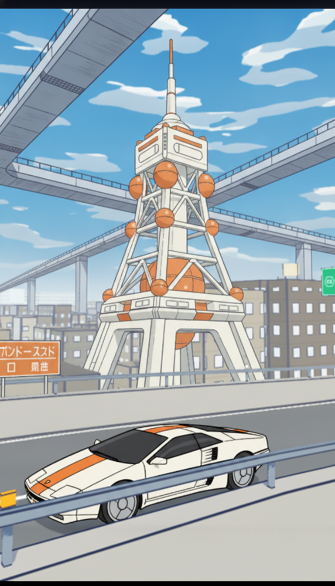
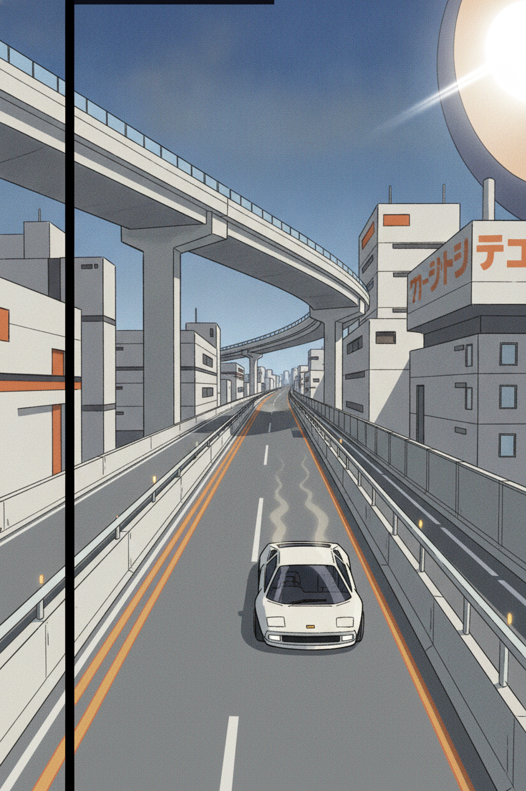
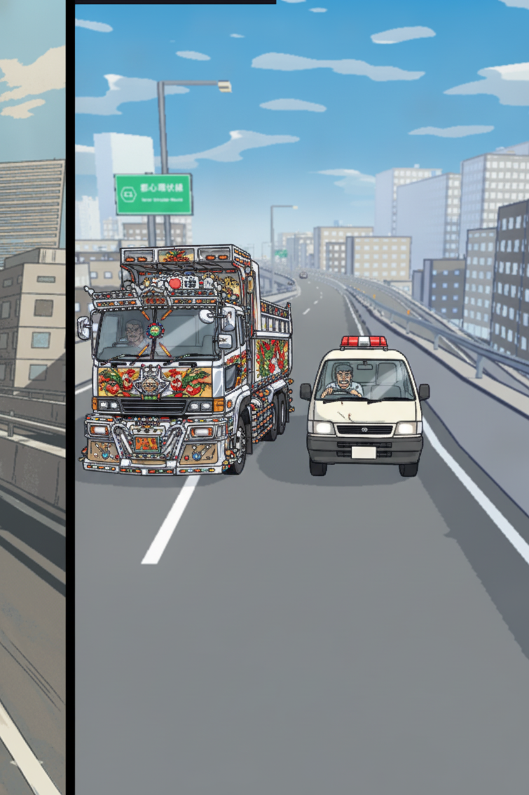
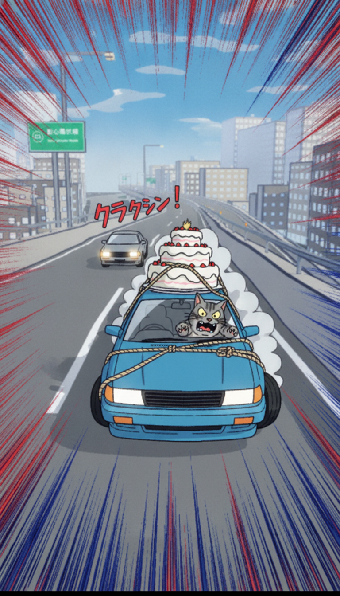

# Tokyo Drift 3D — Game Identity Options

*Consultation with a veteran arcade-racing designer (3 rounds, Gemini), web research, and AI-reimagined mock art from our own v40 screenshots. Written 2026-10-05 for Craig to pick a direction.*

**The setup:** our 80s-anime cel look (v40) hides the cheap low-poly 3D better than any competitor's renderer. The look is the moat. The missing piece is identity: theme, modes, loop, progression, and a reason to come back tomorrow. Not a Horizon knockoff.

**What got killed already:** a straight Showa time-capsule tourist sim (no stakes, history-nerd nitpick hell, players bounce in 45 seconds) and comedy-as-the-entire-game (meme games spike for 48 hours and die; you can't build retention on irony — steelmanned and still killed).

---

## Option 1 — SHUTOKO OUTLAW: HAISOU ⭐ recommended

*Midnight asphalt. Illegal cargo. One mistake ends everything.*

### Theme / setting
Alternate-1988 Japan, fictional highway districts (never real ward names — see the accuracy shield below). By day you're a nobody delivery driver; by night you run the illegal highway. The *Persona* loop meets *Tokyo Xtreme Racer*: the day job funds the night war. Gritty late-80s straight-to-video OVA mood — *Megazone 23*, *Riding Bean*, early *Initial D*.

### Why it fits the anime look
This is the look's home turf. Ink outlines + flat color fields were literally invented for night-highway anime: sodium streetlights, wet asphalt reflections, glowing taillights, hand-painted dusk skies. Day/dusk/night all get used (deliveries at dusk, duels at midnight).

### Modes + core loop + progression
Core 3-minute loop: **pick contract or rival → 150s run → payout in Yen + Rep → spend on the car.**
- **Rival Battle (story ladder):** sequenced boss duels. Beat the area boss, unlock their district. Pre-race 10s anime dialogue slide (AI-generated rival portrait: Smug / Sweating / Defeated).
- **Touge Dogfight:** 2×60s lead/chase rounds — don't get passed, then stay glued to their bumper. Drain their Resolve Bar while ahead (the *Wangan* mechanic).
- **Delivery Board (the infinite loop):** procedural contracts — fragile tofu, midnight newspapers, volatile wedding cakes. Cargo Integrity meter: drift clean or lose the payout. *Crazy Taxi* urgency + *Initial D* precision.
- **Midnight Gauntlet (endless):** cascading rivals on procedural highway traffic until tires/engine give out.

Progression: **Yen** (soft, earned) buys tires/tune-ups/repairs; **Tapes** (hard, rarely earned, purchasable) buys garage bays, aero kits, paint. **Driver License Rank** gates rival tiers (Street Punks → Highway Kings → Legendary Phantoms). **Dispatch Reputation** unlocks longer routes and better contracts.

IAP (never sell horsepower): livery packs ($1.99–4.99), OST cassette tapes ($0.99 — in-game radio channels), manga victory cut-ins ($2.99), dekotora chrome packages ($3.99), **Midnight Pass** ($4.99/30 days: free track = Yen/tires/colors; paid track = exclusive 1986 aero kit, synth tracks, cassette refund). **Never sell:** tire grip / weight distribution. Tuning is earned-Yen only, or the game is dead.

Retention hooks: **The 3AM Ghost** (a phantom black FC haunts the downhill 2–4am, beating it wins a cursed purple-backfire exhaust); **Rush Hour Surge** (8–9am / 6–7pm: 3× pay, 3× traffic); **Sunday Junkyard Scramble** (weekly: clear 3 sectors in a broken death-trap to scavenge a top-tier part).

### Car philosophy: car-culture customization
Tuner authenticity with stylized anonymity — unmistakable nods to JDM legends, never 1:1 copies (Frankenstein-spec: graft an AE86 hatch onto an S12 front clip, call it the *Yamato Twin-Cam 16*). Mismatched rims, oil coolers, taped pop-ups. Working-class sleepers for the delivery side.
1. *"The 8-6 Sprinter"* — AE86 nod: carbon hood, single yellow fog, Watanabes
2. *"Rotary Wedge 7"* — RX-7 FB nod: flares, ducktail, external oil cooler
3. *"Devil-Z Turbo"* — 240Z nod: G-nose kit, bolt-on flares, deep-dish steelies
4. *"Kei-Cargo 550"* — Hijet nod: rusty delivery kei truck (the day job)

### References
- Games: [Wangan Midnight Maximum Tune 6](https://www.gamespark.jp/) (highway duel + story structure), Initial D Arcade Stage (touge lead/chase), Crazy Taxi (delivery urgency)
- Anime: *Initial D* (touge drama), *Wangan Midnight* (highway mythology), *Riding Bean* / *Megazone 23* (OVA grit look target)

### Mock art (re-imagined from our v40 screenshots)

*Midnight duel: indigo sky, sodium lights, underglow, rival ahead.*

*The day job: kei truck at dusk under the tower.*

### Biggest risk
Flat rival writing. If the 2D rival encounters read as generic AI sludge instead of punchy and arrogant, the whole justification for the race collapses into a generic lap-runner. The dialogue is the game.

---

## Option 2 — VECTOR-85: EXPO TRANSIT

*Tear through tomorrow as yesterday imagined it.*

### Theme / setting
Not Showa, not cyberpunk, not modern: the future as **1980s Japanese sci-fi** imagined it. Modular capsule megastructures (Metabolism), Expo '85 pavilion arches, elevated transit viaducts, katakana technical signage, bone-white / signal-orange / cobalt-blue on gunmetal. Zero magenta-cyan neon vomit. You're a test pilot for unstable prototype chassis.

### Why it fits the anime look
The cel look was born for this too — *Galaxy Express 999* and Matsumoto's bridge consoles are flat-color ink-line art already. And it's the only option with **zero accuracy nitpicks possible**: the period never existed, so no nerd can correct you.

### Modes + core loop + progression
Core verb is **HARVEST**, not deliver or outrun. Core 3-minute loop: launch from pneumatic bay → 140s technical run threading mag-lev traffic → drift through induction zones to charge the Turbo-Capacitor → manage the Heat gauge (too greedy = meltdown) → dump charge on final straights through speed traps.
- **Overdrive Trial:** checkpoint gates before an advancing grid-barrier resets the track behind you.
- **Drone Interceptor:** rogue patrol drones lay EMP fields and roadblocks.
- **Ghost Vector:** async ghost time-trials on daily procedural seeds.

Progression: **Heat Sinks / Fuel Cells / Circuit Chips** (earned) → **Fusion Chassis unlocks, Overdrive Cores** (custom boost curves), **Sector Clearance Levels**.

IAP: holographic trails & glitch VFX ($1.99–3.99), prototype shells — visual re-skins into wild retro concept silhouettes ($4.99), FM-synth soundchips ($2.99). Same never-sell-physics rule.

### Car philosophy: retro-concept tuner culture
Expo '85 show-car fantasies, modified by illegal street racers. Wedge profiles, canopy cockpits, turbofan disc wheels, digital-matrix tail lamps.
1. *"Dome-Zero '81"* — Dome Zero nod: extreme wedge, scissor doors
2. *"Piazza-Vector"* — Isuzu Piazza nod: Giugiaro digital-dash silhouette
3. *"SVX-Interceptor"* — Subaru Alcyone/XT nod: aircraft canopy, light pods
4. *"Techno-Midship"* — Toyota FX-1 nod: twin antennas, louvered slats

### References
- Real: [Nakagin Capsule Tower](https://upload.wikimedia.org/wikipedia/commons/thumb/9/9a/Capsules_of_the_Nakagin_Capsule_Tower_dllu.jpg/1280px-Capsules_of_the_Nakagin_Capsule_Tower_dllu.jpg) (Metabolism), Tsukuba Expo '85, 1985 Tokyo Motor Show concepts (Nissan CUE-X, Mazda MX-03)
- Anime: *Galaxy Express 999* ([ref](https://tvdrome.com/tag/%e9%9d%92%e6%98%a5/)), *Space Battleship Yamato* (bridge consoles), early *Gundam* (colony design), Syd Mead's Japanese concept work

### Mock art

*Expo-style pavilion tower with capsule pods, wedge concept car.*

*Elevated mag-transit expressway, induction strips, sun-mirror.*

### Biggest risk
Asset coherence. Sourcing or generating low-poly assets that stay strictly "1985 Japanese retro-futurism" without bleeding into generic Blade Runner cyberpunk or modern sci-fi will stretch art direction to its limit — and it's the highest bespoke-modeling burden of the three options.

---

## Option 3 — TONDEMO EXPRESS

*Dead-serious racing. Deeply unserious cargo.*

### Theme / setting
Same alternate-1988 highway world as Option 1, but the **absurdist comedy is the product**, not the seasoning. In the spirit of [昭和米国物語](https://media.nichegamer.com/wp-content/uploads/2024/11/showa-american-story-11-01-24-1.jpg) (*Showa American Story*): the world takes itself 100% seriously (the *Yakuza* rule) while everything in it is unhinged. You're the most professional driver in the most ridiculous profession.

### Why it fits the anime look
Slapstick reads perfectly in cel shading — manga speed lines, impact starbursts, sound-effect typography (クラクション！) are native to the style. Failures become 5-second shareable clips with zero language barrier.

### Modes + core loop + progression
Core loop: **40-second roguelike hazard gauntlets.** Your vehicle gains procedurally paired, physically simulated absurdities: *Tuna on the Roof* (mass shifts violently on drift) + *Overpowered Left Turbine* + *Greased Brakes*. The joke is emergent slapstick physics, not dialogue — modifiers stack and synergize, and you try to conquer impossible dysfunctions.
- **Cake Run:** deliver hyper-fragile absurd cargo (wedding cakes, unrestrained furious cats — drift too hard and the cat attacks the wheel, inverting controls for 1.5s).
- **Salaryman Showdown:** duel the unhinged kei-van salaryman racing to deliver fax paper before his boss "executes" him.
- **Dekotora Royale:** the secret top-tier unlock isn't a supercar — it's a 100,000-lumen chrome dump truck that blinds rivals, air horn playing 8-bit enka.

Progression: gig ratings, hazard-modifier collection, joke-vehicle garage. IAP: absurd cosmetic packs, horn soundboards, modifier presets. Honest assessment: the **weakest monetization** of the three — irony doesn't convert to seasons.

### Car philosophy: funny, deadpan
Stereotypical working-class vehicles played completely straight.
1. *"Kei-Cargo 550"* — rusty Hijet-nod delivery truck
2. *"The Fax Van"* — dented TownAce-nod, hazards always on
3. *"Chrome Shogun"* — dekotora dump truck, 100k-lumen light wall
4. *"Roof-Cake Special"* — any car + physics-modeled absurd roof cargo

### References
- Games: [Showa American Story](https://nichegamer.com/showa-american-story-reveals-2025-release/) (premise audacity), *Yakuza* series (deadpan-absurd tone rule), *Crazy Taxi*
- Anime: *Excel Saga*, *Bobobo-bo* (unhinged energy); *Initial D* (played straight underneath)

### Mock art

*Chrome dekotora vs. the salaryman's dented kei van. Both deadly serious.*

*Wedding cake roped to the roof. Furious cat in the passenger seat.*

### Biggest risk
Jokes decay. Visual gags die after three exposures, and building enough unique physics modifiers to sustain 20 hours costs triple the content budget of a tight arcade racer. You run out of jokes before the player runs out of battery. The consultant's verdict: **kill as the core, keep as seasoning inside Option 1.**

---

## Recommendation

**Build Option 1 (SHUTOKO OUTLAW: HAISOU).** Ranked:

1. **Option 1** — Best fit for the look, the team, and the business. The B+E hybrid gives you two loops for the price of one system (deliveries are procedural and infinite; rivals are cheap 2D content gating). The accuracy shield (fictional district codes, Frankenstein-spec cars, explicit alternate-1988 splash) kills the history-nerd problem without research. Comedy goes in as seasoning (dekotora unlock, cat cargo, salaryman rival) — all the 搞抽象 joy, none of the retention risk. Shippable v1 in ~3 months with brutal cuts: no open-world roaming (node map), one arcade handling model with 3 sliders, 2D visual-novel rivals, async ghosts only.
2. **Option 2** — The bold pick. Genuinely differentiated (nobody owns "1985's future"), zero accuracy risk, and the mocks slap. But it's the heaviest art burden and the loop (thermal vectoring) is the least proven. Keep as the expansion-world candidate once Option 1 retains.
3. **Option 3** — Don't build it standalone. Fold its three best bits (dekotora unlock, volatile cargo missions, salaryman rival) into Option 1's seasoning and you get 90% of the joy at 0% of the structural risk.

**The single decision that matters most:** the rival dialogue quality in Option 1. Punchy, arrogant, quotable — or the whole thing is a lap-runner with extra steps. Write (or generate-and-ruthlessly-edit) the first 10 rival encounters before building anything else; if they don't make you grin, the direction is wrong.

---

*Appendix: consultation transcripts — [round 1](consult/round1.md), [round 2](consult/round2.md), [round 3](consult/round3.md). Base screenshots: v40 in-engine captures from `godot/qa/td-glowup-04/r2/`.*
